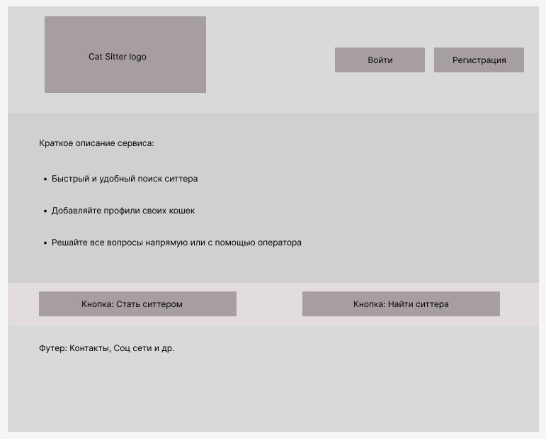

# Cat sitter

Cat Sitter
Приложение, которое помогает владельцам кошек найти ответственного человека (ситтера) 
в своём городе, чтобы тот присмотрел за питомцем во время отъезда хозяина. 
Сервис сводит хозяина и «кошко-ситтера» на период отпуска или длительной командировки.

## Визуальная схема фронтенда

1. Маркетинг и аналитика
   1. [Целевая аудитория](./docs/01-biz/audience.md)
   2. [Cтейкхолдеры](./docs/01-biz/staceholders.md)
2. MVP (Минимально жизнеспособный продукт)
   1. [MVP](./docs/analisis/mvp.md)
3. Архитектура
   1. [API](./docs/architecture/api.md)
4. DevOps
   1. [Файлы сборки](./deploy)